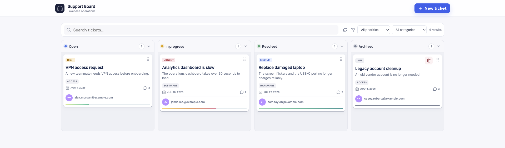
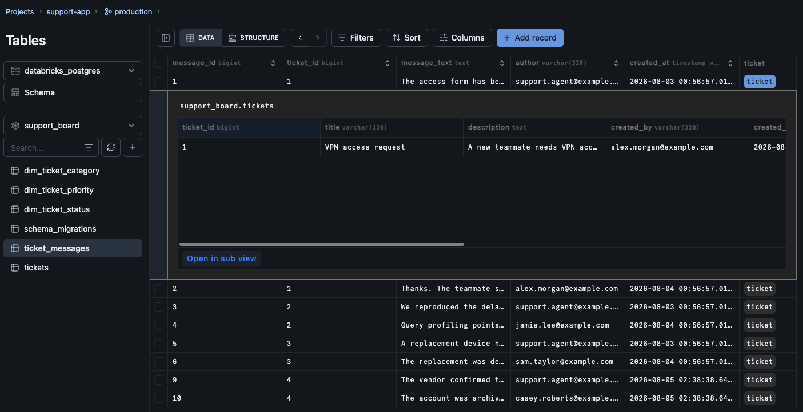
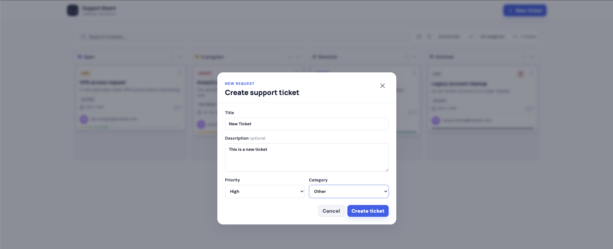
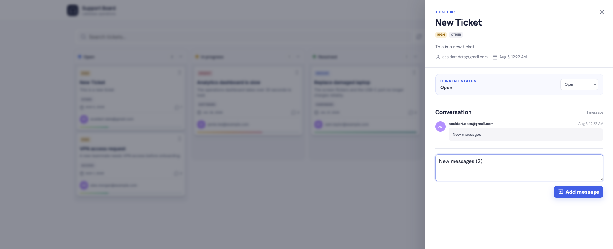
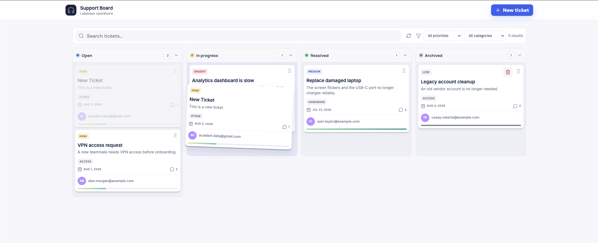
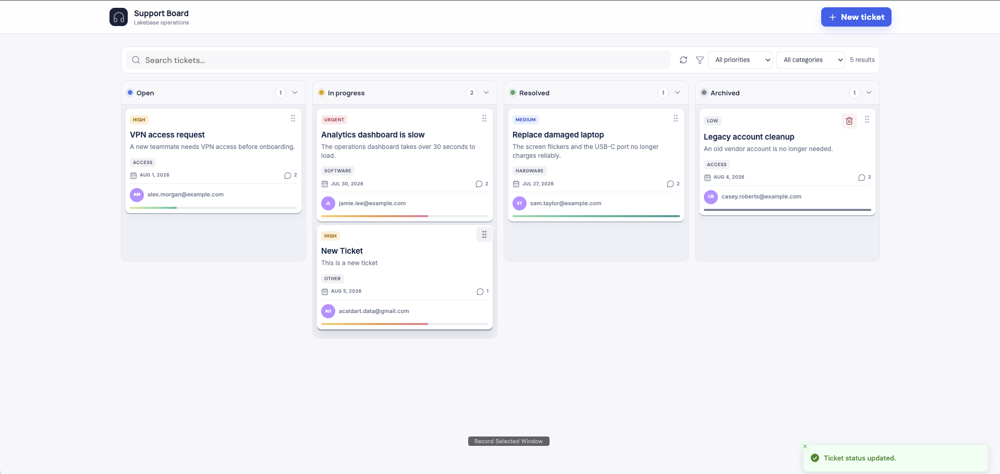
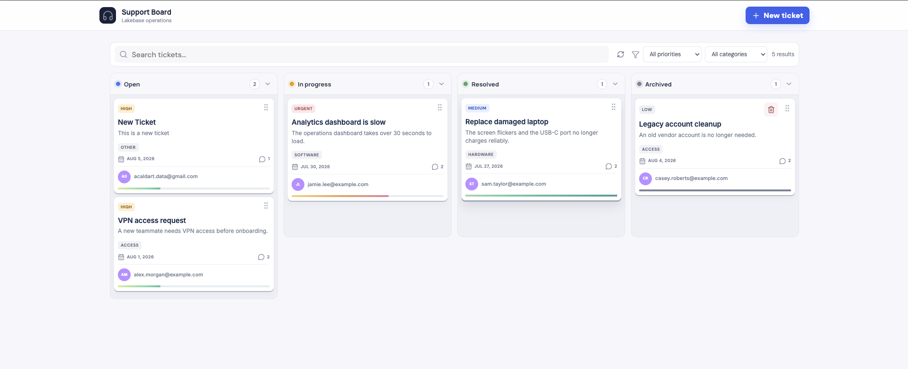

# Databricks App Homework Submission

## Your Databricks App URL

[Lakebase Support Board](https://lakebase-support-board-7474651690783296.aws.databricksapps.com/)

## Source code repository

[GitHub repository](https://github.com/acaldo/lakebase-support-app)

## Screenshot of the deployed application

## Screenshot showing the Lakebase tables and sample records

## Deployed application workflow evidence

The following screenshots document the main data operations in the deployed Databricks App.

### Creating a new ticket

The new-ticket form captures the title, description, priority, and category before submitting the ticket.

### Viewing a ticket and adding a message

The ticket detail view displays the ticket information and existing conversation. A new message can be entered and added to the conversation.

### Updating the ticket status

The first screenshot shows the new ticket before the status change. The second shows it moved to **In progress**, with the confirmation message `Ticket status updated.`.

### Persistence after refreshing the application

After refreshing the deployed application, the newly created ticket remains visible in the board, demonstrating that the data was persisted in Lakebase.

## Reflection

### What was the most difficult part?

The most difficult part was figuring out how to configure the Lakebase connection for a Databricks App.

### How is Lakebase different from storing this data in a traditional analytics table?

At this stage, I did not notice a major difference compared with storing the data in a traditional PostgreSQL database, although having the application and database together in one platform should make the overall setup easier. I expect features such as Change Data Feed (CDF) and Agent Bricks could provide important benefits, but that is still an assumption because I have not used them yet.

### What feature would you add next?

I would add document uploads stored in an S3-compatible bucket, restructure the database to support multiple projects or boards with user roles, and implement CDF.
